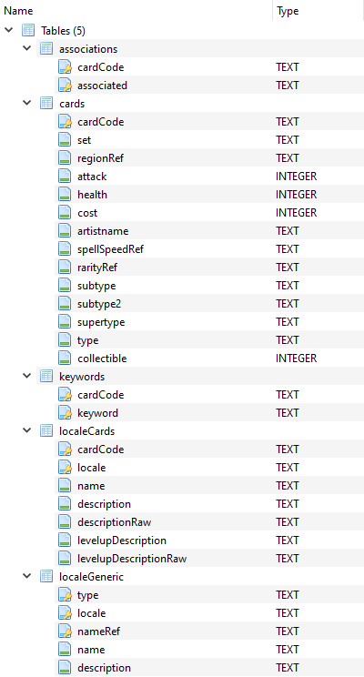

# LoR Database Builder
Generates an SQLite database with all the data avaliable through the Legends of Runeterra Data Dragon. It supports building for any version and include any locale you desire (en_us is always included).

## Structure
The database has the following structure:<br>


## Usage
Run from a terminal with the following (optional) parameters:<br>
On Windows:<br>
```lordbb.exe -v Version locale1 locale2 locale3...```<br>
On Linux:<br>
```lordbb -v Version locale1 locale2 locale3...```<br><br>
**Note:** The process of building the database is long and can take up to an hour.
### Examples
- Latest version, All locales:
  - ```lordbb```
- Version 1.6.0, All locales:
  - ```lordbb -v 1.6.0```
- Latest version, Spanish locales:
  - ```lordbb es_es es_mx```
- Version 1.6.0, German locale:
  - ```lordbb -v 1.6.0 de_de```

## Build
Clone the repo, go into ```lordbb``` and run ```go build```, an executable named ```lorddb``` in Linux or ```lorddb.exe``` will be created there.

## To Do
Write better code

## Legal
LoR Database Builder was created under Riot Games' "Legal Jibber Jabber" policy using assets owned by Riot Games.  Riot Games does not endorse or sponsor this project.
